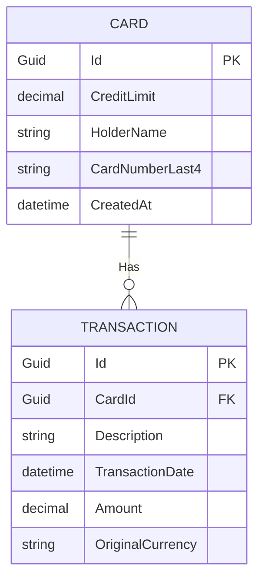

# Project Brief: Treasury Card & Transaction Management System

## Overview
This document outlines the requirements, architectural design, technical stack, and implementation strategy for the **Treasury Card & Transaction Management System**. This system is designed as a production-ready application to manage cards, transactions, and currency conversions using the [Treasury Reporting Rates of Exchange API](https://fiscaldata.treasury.gov/datasets/treasury-reporting-rates-exchange/treasury-reporting-rates-of-exchange).

---

## Technical Stack

| Layer | Technology | Rationale |
| :--- | :--- | :--- |
| **Backend** | C# / .NET 10 (Controller-based API) | Standardized, recognizable routing, model validation, and DI structure for enterprise applications, leveraging the cutting-edge .NET 10 runtime. |
| **Frontend** | Next.js 16 (App Router, Turbopack, React 19) | Modern, reactive UI with Server-Side Rendering (SSR) capabilities, leveraging the latest React 19 features. |
| **Database** | PostgreSQL 17 (via EF Core 10) | Latest stable relational database with strong performance and JSONB support. |
| **Orchestration** | Docker / .NET Aspire 10 | Containerizes and orchestrates all components (Next.js frontend, C# backend API, and PostgreSQL 17 database) to guarantee consistent deployment and run environments. |
| **Testing** | xUnit, Moq, WebApplicationFactory | Standard testing suite for unit, integration, and API testing. |
| **API Docs** | Scalar / OpenAPI 3.0 | Premium, modern interactive documentation UI for the API endpoints. |

---

## Core Requirements

### 1. Card Management
* **Requirement**: Create and store cards with a credit limit.
* **Identifier**: When a card is stored, it must be assigned a unique identifier (UUID).

### 2. Transaction Management
* **Requirement**: Store purchase transactions associated with a specific card.
* **Fields**: A transaction must include a description, transaction date, and an amount.

### 3. Currency Conversion (Reporting)
* **Requirement**: Retrieve stored transactions converted to target currencies supported by the Treasury Reporting Rates of Exchange API, based upon the exchange rate active on the date of the purchase.
* **Returned Format**: The retrieved transaction must include:
  * Transaction Identifier
  * Description
  * Transaction Date
  * Original Amount
  * Exchange Rate Used
  * Converted Amount in the specified currency
* **Conversion Rules**:
  * **Strict Date-Window Check**: Use a currency conversion rate dated **on or before** the transaction date, from within the **prior 6 months**.
  * **Failure Handling**: If no currency conversion rate is available within the 6-month window on or before the transaction date, the application must return a clear error stating the transaction cannot be converted to the target currency.

### 4. Balance Retrieval
* **Requirement**: Retrieve a card's available balance in a specified currency.
* **Calculation**: Available Balance = `Credit Limit` - `Sum(All Recorded Transactions)`.
* **Conversion Rules**:
  * When converting the balance to a target currency, use the **latest available exchange rate** for that currency from the Treasury Reporting Rates of Exchange API.

---

## Docker Containerization Structure
To ensure production-grade parity, absolute convenience, and a seamless local setup, every service runs inside its own Docker container. 

> [!IMPORTANT]
> Developers and reviewers **do not need** .NET or Node.js installed on their host machine. Docker is the sole local dependency. All compilation, package management, and runtime orchestration are handled automatically inside containerized environments via multi-stage Docker builds.

1. **`frontend` Container**: Runs the Next.js 16 web UI (Node-based Alpine image).
2. **`backend-api` Container**: Runs the C# / .NET 10 REST API (utilizing built-in in-memory caching).
3. **`database` Container**: Runs the PostgreSQL 17 relational database.

All containers are defined and orchestrated via **Docker Compose**, allowing developers to launch the entire system with a single command:
```bash
docker compose up --build
```
Or optionally via **.NET Aspire 10** if a local SDK is present.

---

## Implementation Strategy & Engineering Boundaries

### 1. Database Schema Design (EF Core)



### 2. Caching Strategy (`IMemoryCache`)
Since the Treasury Reporting Rates of Exchange are published quarterly/monthly and do not change by the second, we must cache these rates to:
* Optimize API performance and lower response times.
* Prevent rate-limiting or service degradation on the external Treasury API endpoints.
* **Structure**: Implement a caching mechanism where fetched rates are indexed by currency and date, using `IMemoryCache` (local memory) built directly into the .NET runtime.

### 3. Treasury Client Resilience & External API Communication
To handle network volatility and rate limiting gracefully when requesting data from the external Treasury API, we must configure a highly resilient `TreasuryHttpClient` using `IHttpClientFactory` integrated with **Polly** (using the modern .NET resilience pipelines).

#### A. Target Failure Criteria
Resilience policies must trigger only on **Transient Faults**:
* HTTP Status Codes: `429 Too Many Requests`, `500 Internal Server Error`, `502 Bad Gateway`, `503 Service Unavailable`, `504 Gateway Timeout`.
* Network issues: TCP/socket connection errors, request timeouts (`TaskCanceledException`).

#### B. Retry with Exponential Backoff and Jitter
* **Backoff Strategy**: Exponentially increase delay between retries to avoid overwhelming the external API during recovery:
  $$\text{Delay} = 2^{\text{attempt}} \text{ seconds}$$
* **Jitter**: Apply a random noise offset (e.g., $\pm 20\%$) to the delay. This prevents synchronized concurrent retries (the "thundering herd" problem) from hitting the Treasury API simultaneously.
* **Rate-Limit Awareness**: If a `429 Too Many Requests` status is returned, the retry policy must inspect the `Retry-After` HTTP header and delay the next retry by that specified duration rather than using the default exponential delay.
* **Max Retries**: Capped at `3` attempts before failing over.

#### C. Circuit Breaker Policy
To protect backend application threads from hanging when the Treasury API suffers a prolonged outage:
* **Failure Threshold**: Open the circuit if **5 consecutive failures** or **50% of calls fail** within a sliding 30-second window.
* **Breaker Duration**: Stay open for **30 seconds**. During this time, all calls fail-fast immediately (throwing a `BrokenCircuitException`), preventing wasted HTTP calls.
* **Half-Open Probe**: After 30 seconds, allow a single "canary" request through to test if the Treasury API has recovered. If successful, close the circuit; if it fails, reopen it for another 30 seconds.

#### D. Request Timeouts
* Enforce a maximum HTTP timeout of **10 seconds** per individual API request to prevent threads from locking indefinitely.

### 4. Database Seeding & Auto-Migration
* **Auto-Migration**: At C# application startup inside the Docker container, the API will run EF Core migrations (`dbContext.Database.MigrateAsync()`) automatically to guarantee the database schema is up-to-date.
* **Seeding**: The application will seed sample Cards and Transactions if the database is empty, allowing reviewers to test and view conversion endpoints immediately without manual entry.

### 5. Container Network & CORS Configuration
* **Dual-Access Networking**:
  * **Client Requests**: Next.js client-side requests in the browser will target the backend API via the host-forwarded port (e.g., `http://localhost:5000`).
  * **Server-Side Render (SSR) Requests**: Next.js server-side requests will route over the internal Docker network directly (e.g., `http://backend-api:8080`).
* **CORS Policy**: The backend API will explicitly enable CORS for the Next.js frontend container's origins to prevent browser security blocks.

### 6. Standardized HTTP API Error Responses (RFC 7807)
* **Design**: Standardize all API error outputs using **RFC 7807 (Problem Details for HTTP APIs)** format.
* **Fields**: Return clear `type`, `title`, `status`, and details context (e.g., why an exchange rate check failed or which validation rule was breached).

### 7. Strict Input Validation
* **Data Sanitization**:
  * Credit limits and purchase amounts must be positive decimal numbers.
  * Currency parameters must comply with **ISO 4217** codes (e.g., `USD`, `EUR`, `GBP`) and automatically handle uppercase conversion.
  * Transaction dates cannot be set in the future.

---

## Execution Plan

### Phase 1: Domain & Database Setup
1. Define the `Card` and `Transaction` domain models.
2. Configure Entity Framework Core with migrations for PostgreSQL.
3. Design repository patterns for persistence.

### Phase 2: Treasury API Integration & Caching
1. Implement the resilience-wrapped `TreasuryHttpClient` using Polly.
2. Develop the conversion rates lookback logic (6-month date window).
3. Set up `IMemoryCache` to index exchange rates.

### Phase 3: Controller Endpoints & OpenAPI Documentation
1. Create `CardsController` and `TransactionsController`.
2. Add comprehensive model validations (e.g., limits must be > 0, transaction dates cannot be in the future).
3. Integrate Scalar OpenAPI documentation (`/scalar/v1`).

### Phase 4: Verification & Automated Testing
1. Write unit tests for the date-matching logic and conversion windows.
2. Write integration tests using `WebApplicationFactory` to spin up a test database container (using Testcontainers or Aspire) and verify end-to-end API flows.
