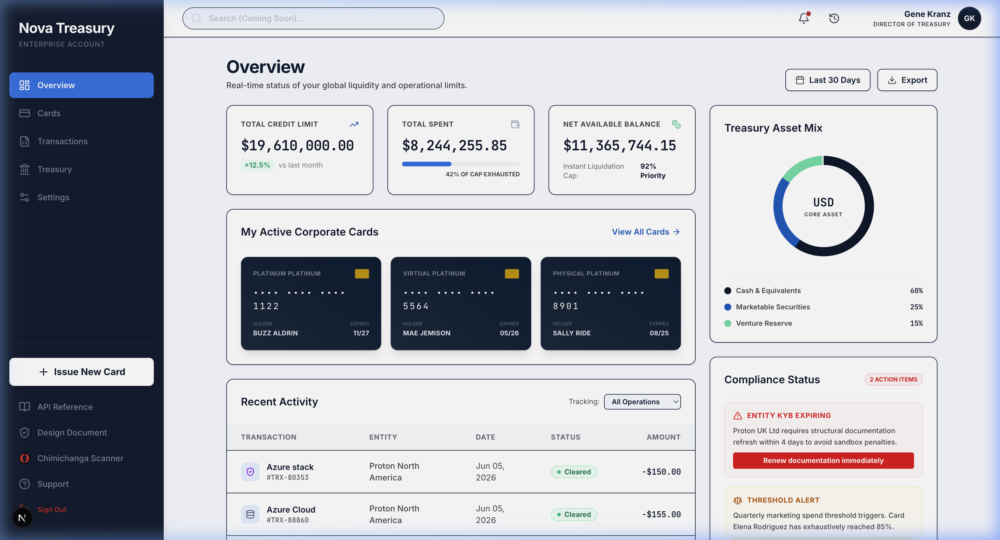
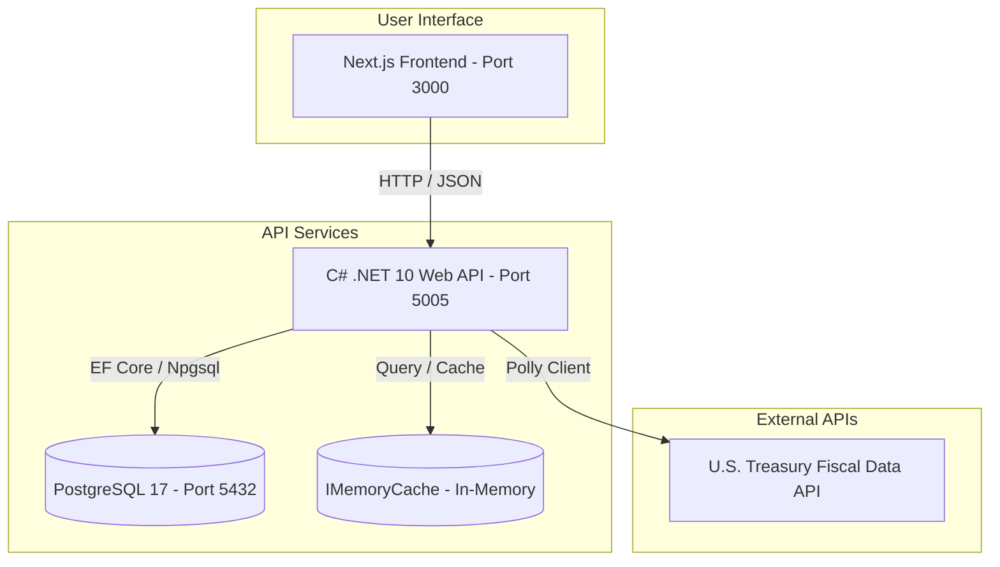

# 🏦 Nova Treasury: Corporate Card & Transaction Ledger

Nova Treasury is a premium, real-time treasury management application that facilitates corporate card issuance, transaction tracking, and multi-currency exchange rate conversions. The system leverages the **U.S. Treasury Reporting Rates of Exchange API** with robust caching and resilient retry mechanisms to deliver accurate conversion calculations.



---

## 🏛️ System Architecture



---

## 🛠️ Technology Stack

- **Frontend**: Next.js 16 (React), TypeScript, TailwindCSS.
- **Backend**: .NET 10 Web API, Entity Framework Core (Code First), PostgreSQL 17, SQLite (for isolation testing).
- **Resilience**: Polly v8 (Exponential Backoff, Jitter, 429 `Retry-After` Header Parsing, Circuit Breaker).
- **Security & Performance**: Fixed Window Rate Limiting, Global Exception Handling middleware, and EF Core read-only query tracking optimization (`.AsNoTracking()`).
- **Documentation**: Scalar OpenAPI v1 (`/scalar/v1`).
- **Health Checks**: Custom JSON Health Monitor with split `/health/live` and `/health/ready` probes.
- **Deployment**: Multi-stage Docker Compose orchestration.

---

## ✨ Key Features

1. **Card Lifecycle Management**: Issue virtual/physical cards, set corporate limits, and freeze/unfreeze cards instantly.
2. **Transaction Ledger**: Track real-time corporate card transactions with automated balance deductions and validations (preventing over-drafting locked or frozen cards).
3. **Resilient Exchange Client**:
   - **Exponential Backoff with Jitter**: Automatically retries failed Treasury API requests.
   - **Rate-Limit (429) Awareness**: Reads the `Retry-After` header dynamically to throttle backoff times.
   - **Circuit Breaker**: Trips for 30 seconds if 5 consecutive calls fail or the error rate exceeds 50%.
   - **In-Memory Caching**: Caches exchange rate query results to prevent rate limiting.
4. **Strict Currency Lookback Engine**:
   - Finds the closest exchange rate on or _before_ the transaction date.
   - Restricts rates to a strict **6-month window**. If no rate exists, the transaction fails gracefully (consistent with treasury rules).

---

## 🚀 Getting Started

### Prerequisites

- [Docker Desktop](https://www.docker.com/products/docker-desktop/)
- [.NET 10 SDK](https://dotnet.microsoft.com/download/dotnet/10.0) (if running on host)
- [Node.js 20+](https://nodejs.org/) (if running on host)

---

### Option A: Using the Startup Script (Recommended)

To automatically build, boot, wait for the Next.js frontend to be ready, and open the application in your default browser, run the provided startup script.

#### 🍎 macOS & 🐧 Linux

First, ensure the script has execution permissions, then run it:

```bash
chmod +x start.sh
./start.sh
```

#### 🪟 Windows

Since standard Command Prompt (`cmd.exe`) and PowerShell do not natively support shell scripts, run the script within a Unix-compatible emulator (such as **Git Bash** or a **WSL terminal**):

```bash
chmod +x start.sh  # (If needed in Git Bash / WSL)
./start.sh
```

---

### Option B: Manual Containerization (Docker Compose)

To manually boot the entire stack (Database, C# API, and Next.js Frontend) in isolated containers:

1. **Clone the repository**:
   ```bash
   git clone https://github.com/crow131/nova-treasury.git
   ```
2. **Navigate to the project directory**:
   ```bash
   cd nova-treasury
   ```
3. **Build and start the containers**:
   ```bash
   docker compose up --build
   ```
4. **Access the applications**:
   - **Next.js Frontend**: [http://localhost:3000](http://localhost:3000)
   - **C# Backend API**: [http://localhost:5005](http://localhost:5005)
   - **Scalar OpenAPI Docs**: [http://localhost:5005/scalar/v1](http://localhost:5005/scalar/v1)
   - **Liveness Probe**: [http://localhost:5005/health/live](http://localhost:5005/health/live)
   - **Readiness Probe**: [http://localhost:5005/health/ready](http://localhost:5005/health/ready)

---

### Option C: Local Development (Host Machine)

To run the database in Docker and the frontend/backend on your host machine for fast code iteration:

1. **Spin up the Postgres container only**:
   ```bash
   docker compose up database -d
   ```
2. **Run the Backend API**:
   ```bash
   cd backend-api
   dotnet run
   ```
   _The backend will listen on `http://localhost:5005` (HTTP) and `https://localhost:5006` (HTTPS)._
3. **Run the Frontend App**:
   ```bash
   cd frontend
   npm run dev
   ```
   _The frontend will listen on `http://localhost:3000`._

---

## 🚦 API Endpoints

### 🩺 Health Checks

- `GET /health/live` - Quick liveness probe returning `200 OK` (Healthy) to signify process is active.
- `GET /health/ready` - Readiness probe verifying database connectivity, migration status, and latency details.
- `GET /health` - Backward-compatible alias for the readiness check.

### 💳 Cards

- `GET /api/cards` - Returns all corporate cards.
- `POST /api/cards` - Issues a new corporate card.
- `PUT /api/cards/{id}/limit` - Adjusts the spending limit of a card.
- `POST /api/cards/{id}/toggle-status` - Freezes or activates a card.
- `GET /api/cards/{id}/balance?currency={code}` - Calculates and converts the available card balance using U.S. Treasury exchange rates.

### 💸 Transactions

- `GET /api/transactions` - Returns the transactional ledger.
- `POST /api/transactions` - Records a new transaction (deducts limit, verifies balance, applies exchange rates).

---

## 🧪 Running Automated Tests

To run the xUnit test suite (which validates the Treasury currency conversion lookback, window bounds, rate limiting, and exception middleware mapping):

```bash
dotnet test backend-api.Tests/backend-api.Tests.csproj
```
